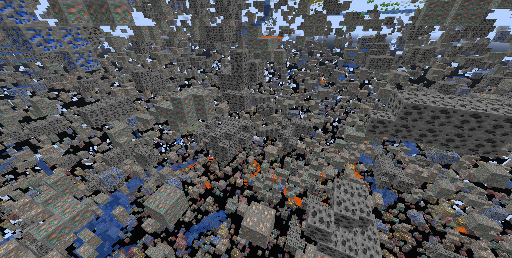
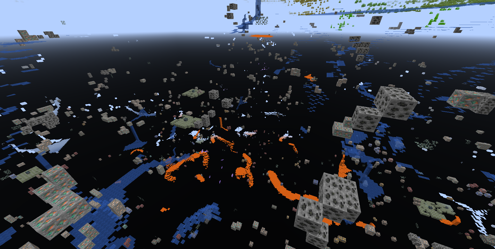
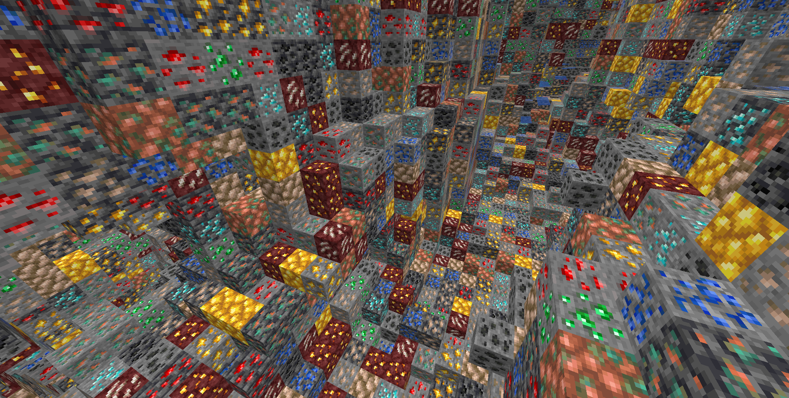
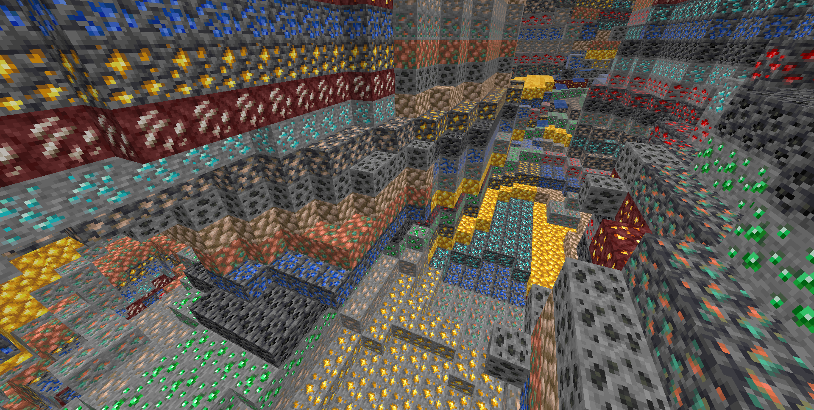

# Anti Xray

Anti Xray is a lightweight fabric mod that allows server owners to combat xrayers.

## Config

```toml
# Default values
enabled = false

# World specific values
[overworld]
enabled = true
engineMode = 3
maxBlockHeight = 256
updateRadius = 2
lavaObscures = false
hiddenBlocks = ["#c:ores", "raw_copper_block", "raw_iron_block", "raw_gold_block"]
replacementBlocks = ["stone", "deepslate", "andesite", "calcite", "diorite", "dirt", "granite", "gravel", "sand", "tuff", "mossy_cobblestone", "obsidian", "clay", "infested_stone", "amethyst_block", "budding_amethyst", "chest"]

[the_nether]
enabled = true
engineMode = 1
maxBlockHeight = 128
updateRadius = 2
lavaObscures = true
hiddenBlocks = ["ancient_debris", "nether_quartz_ore", "nether_gold_ore", "gold_block", "gilded_blackstone"]
```

### Config option overview

`enabled` if set to true anti xray will be active in the specified world

`engineMode` can either be 1, 2 or 3 see [Engine Modes](#Engine Modes)

`maxBlockHeight` controls the max height at which blocks should get obfuscated

`updateRadius` controls how many blocks away from shown blocks obfuscation should start (if your players see fake ores
it is recommended to increase this value)

`lavaObscures` if set to true blocks next to lava will get obscured

`hiddenBlocks` a list of blocks to hide *(Engine mode 1)* or a list of blocks to use for obfuscation *(Engine mode 2/3)*

`replacementBlocks` is a list of blocks that will be obfuscated, but not used as fake blocks *(Engine mode 2/3 only)*

### Engine Modes

| Info | Image |
:-------------------------:|:-------------------------:
**Anti xray disabled:** This is just for reference |  
**EngineMode 1:** This mode will replace all fully obscured (no air around) blocks from `hiddenBlocks` with blocks from `replacementBlocks` |  
**EngineMode 2:** This mode will replace all blocks from `hiddenBlocks` and `replacementBlocks` with random blocks from `hiddenBlocks` |  
**EngineMode 3 (recommended):** Works very similar to engine mode 2, but works better with slow connections |  
**Legit player view:** Legit players wont notice any changes when this mod is installed (unless they have high ping or modify a lot of blocks at once, eg: explosions)

## About

This mod is a port of Papers [Async Anti Xray Patch](https://github.com/PaperMC/Paper/blob/7a64b85f9274f9a01103faafcfceb89a8b5777de/patches/server/0344-Anti-Xray.patch) from 1.17 and [it's 1.14 patch](https://github.com/PaperMC/Paper/blob/ver/1.14/Spigot-Server-Patches/0397-Anti-Xray.patch#L1379) for networking code, to fabric and forge
